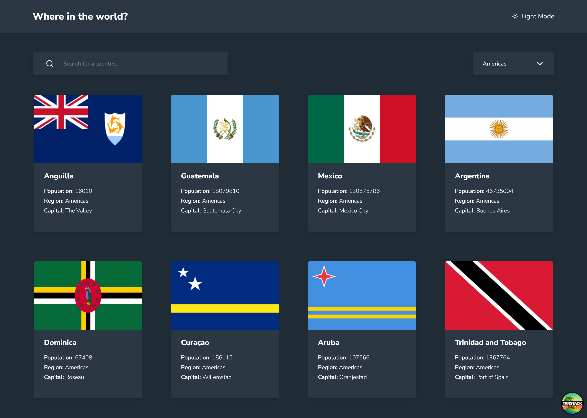

# Frontend Mentor - REST Countries API with color theme switcher solution

A premium country explorer built with React and Tanstack, featuring real-time searching,
regional filtering and seamless navigation between over 250 nations.

This is a solution to the [REST Countries API with color theme switcher challenge on Frontend Mentor](https://www.frontendmentor.io/challenges/rest-countries-api-with-color-theme-switcher-5cacc469fec04111f7b848ca). Frontend Mentor challenges help you improve your coding skills by building realistic projects. 


## Overview


### Screenshot




### Links

- Solution URL: [Add solution URL here](https://your-solution-url.com)
- Live Site URL: [Add live site URL here](https://your-live-site-url.com)

### Features
- **Search**: Instant country lookup with client-side filtering.
- **Filter**: Narrow down countries by continent (Africa, Americas, Asia, Europe, Oceania).
- **Detail View**: Full statistics for every country, including border navigation.
- **Theme Toggle**: Accessible dark/light mode implementation.
- **URL-Driven State**: Shareable URLs for search and filter results.

## Getting Started
To run this project on your system, you need Node.js and any package manager of your choice installed.

### Prerequisites
- Node.js (v18+)
- pnpm / npm / yarn

### Installation
```bash
# Clone the repository
git clone https://github.com/Tejiri-A/where-in-the-world.git

# Install dependencies
pnpm install

# Start the development server
pnpm dev
```

## My process

### Built with

- **React 19**
- **TanStack Router** (Type-safe file-based routing)
- **TanStack Query** (Server state management)
- **Tailwind CSS** (Modern styling)
- **Zod** (Search parameter validation)

### Decisions

### Why TanStack Router over React Router?
I chose **TanStack Router** for its superior type safety and built-in search parameter validation. Unlike traditional routers, it treats the URL as a first-class state store. This allowed me to keep the search and filter state in the URL without the "syncing" headaches typically found in SPAs.

### Why TanStack Query?
Even though the REST Countries API is relatively static, **TanStack Query** allowed me to:
1.  **Deduplicate requests**: The "All Countries" list is fetched once and cached.
2.  **Instant Border Navigation**: When clicking a border country, we reach into the existing cache rather than making a new API call, making the app feel like a desktop application.

### Dark Mode Implementation
The theme is managed via a `ThemeProvider` using a `dark` class on the `<html>` element. This integrates seamlessly with Tailwind's `dark:` utilities and persists in `localStorage`.


### Continued development

1. **Virtualization**: Rendering large datasets at once is not good for performance. Virtualization renders extra information as the user scrolls down to prevent their devices from being overwhelmed

### Useful resources

- [How To Use React Query With TanStack Router](https://www.youtube.com/watch?v=XVBoMIwBK8M) - I did not know how to integrate tanstack query into tanstack router until I watched this video. Creator is straigh to the point and easy to understand


### AI Collaboration

I only used AI to assist me with my architectural decisions and to guide me on the use of Tanstack Query with Tanstack router and the use of Tanstack router's powerful search parameters mechanism.

## Author

- Website - [Add your name here](https://www.your-site.com)
- Frontend Mentor - [@yourusername](https://www.frontendmentor.io/profile/yourusername)
- Twitter - [@yourusername](https://www.twitter.com/yourusername)


